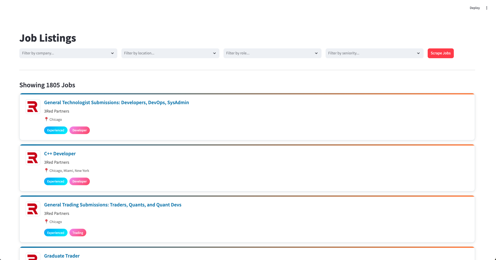

# Automated Job Scraper & Dashboard

This project is a Python-based application that automatically scrapes job listings from various company career pages, classifies them by role and seniority, and displays them in an interactive web dashboard built with Streamlit.



## Features

- **Automated Scraping**: Modular scrapers for different job board platforms (Greenhouse, Lever, Workable, etc.).
- **Job Classification**: Automatically classifies job titles into roles (e.g., Developer, Trader) and seniority (e.g., Senior, Graduate) using a keyword-based system.
- **Location Normalization**: Parses and standardizes messy location strings (e.g., "NYC / Remote" becomes "New York", "Remote").
- **Persistent Storage**: Scraped and classified job data is stored in a local SQLite database.
- **Stale Job Deactivation**: Automatically marks jobs as inactive if they are no longer found during a scrape.
- **Interactive Dashboard**: A web interface built with Streamlit that allows for filtering jobs by company, location, role, and seniority.

## Tech Stack

- **Backend**: Python
- **Web Framework**: Streamlit
- **Data Manipulation**: Pandas
- **Database**: SQLite
- **Web Scraping**: `requests`
- **Configuration**: `python-dotenv`

## Project Structure

```

.
├── assets/                 \# Company logos and images
├── config/                 \# CSV files for initial data seeding
│   ├── companies.csv
│   └── ... (other config csvs)
├── scrapers/               \# Scraper modules
│   ├── **init**.py
│   ├── base\_scraper.py
│   └── greenhouse.py
│   └── ... (other scrapers)
├── .env                    \# (Local Only) Your environment variables
├── .env.example            \# Template for environment variables
├── .gitignore              \# Specifies files for Git to ignore
├── app.py                  \# The Streamlit web application
├── classifier.py           \# Job title classification logic
├── data\_manager.py         \# Handles all database interactions
├── database\_setup.py       \# One-time script to initialize the database
├── location\_normalizer.py  \# Logic for cleaning location strings
├── main.py                 \# Main script to run the scraping and classification process
├── models.py               \# Defines the Job dataclass
├── requirements.txt        \# Python package dependencies
└── README.md               \# This file

````

## Setup and Installation

Follow these steps to get the project running on your local machine.

### 1. Clone the Repository
```bash
git clone [https://github.com/your-username/your-repo-name.git](https://github.com/your-username/your-repo-name.git)
cd your-repo-name
````

### 2\. Install Dependencies

It is recommended to use a virtual environment.

```bash
python3 -m venv venv
source venv/bin/activate
pip install -r requirements.txt
```

### 3\. Set Up Environment Variables

This project uses a `.env` file to manage scraper configurations.

First, copy the example template to create your own local configuration file:

```bash
cp .env.example .env
```

Next, open the new `.env` file and **paste the following public identifiers** into it.

```
# -- Greenhouse Board Tokens --
GREENHOUSE_TOKEN_FIVE_RINGS_CAPITAL="fiveringsllc"
GREENHOUSE_TOKEN_FLOW_TRADERS="flowtraders"
GREENHOUSE_TOKEN_OPTIVER="optiverus"
GREENHOUSE_TOKEN_QUBE_RESEARCH_&_TECHNOLOGIES="quberesearchandtechnologies"
GREENHOUSE_TOKEN_GENEVA_TRADING="genevatrading"
GREENHOUSE_TOKEN_POINT72="point72"
GREENHOUSE_TOKEN_IMC_TRADING="imc"
GREENHOUSE_TOKEN_MAVERICK_DERIVATIVES="maverickderivatives"
GREENHOUSE_TOKEN_3RED_PARTNERS="3redpartners"
GREENHOUSE_TOKEN_VIRTU_FINANCIAL="virtu"
GREENHOUSE_TOKEN_JANE_STREET="janestreet"
GREENHOUSE_TOKEN_AKUNA_CAPITAL="akunacapital"
GREENHOUSE_TOKEN_LIFE_TRADING="lifetrading"
GREENHOUSE_TOKEN_MAKO_TRADING="mako"
GREENHOUSE_TOKEN_DV_TRADING="dvtrading"
GREENHOUSE_TOKEN_HUDSON_RIVER_TRADING="wehrtyou"
GREENHOUSE_TOKEN_JUMP_TRADING="jumptrading"
GREENHOUSE_TOKEN_DA_VINCI_TRADING="davinciderivatives"
GREENHOUSE_TOKEN_RADIX="radixuniversity"
GREENHOUSE_TOKEN_ALPHAGREP="alphagrepsecurities"
GREENHOUSE_TOKEN_OLD_MISSION_CAPITAL="oldmissioncapital"
GREENHOUSE_TOKEN_EPOCH_CAPITAL="epochcapital"
GREENHOUSE_TOKEN_XY_CAPITAL="xycapital"
GREENHOUSE_TOKEN_DRW="drweng"
GREENHOUSE_TOKEN_XTX_MARKETS="xtxmarketstechnologies"
GREENHOUSE_TOKEN_MAVEN_SECURITIES="mavensecuritiesholdingltd"
GREENHOUSE_TOKEN_QUANTBOX_RESEARCH="quantboxresearchpte"
GREENHOUSE_TOKEN_CHICAGO_TRADING_COMPANY="chicagotrading"
GREENHOUSE_TOKEN_VIVCOURT_TRADING="vivcourt"
GREENHOUSE_TOKEN_ECLIPSE_TRADING="eclipsetrading"
GREENHOUSE_TOKEN_TOWER_RESEARCH_CAPITAL="towerresearchcapital"

# -- Lever Sites --
LEVER_SITE_WOLVERINE_TRADING="wolve"
LEVER_SITE_BELVEDERE_TRADING="belvederetrading"
LEVER_SITE_QUANTLANE="quantlane"

# -- Workable Subdomains --
WORKABLE_SUBDOMAIN_TIBRA_CAPITAL="tibra-capital-1"
WORKABLE_SUBDOMAIN_EAGLE_SEVEN="eagle-seven"

# -- Recruitee Slugs --
RECRUITEE_SLUG_BLOCKTECH="blocktech"
RECRUITEE_SLUG_MATHRIX="mathrix"
```

### 4\. Initialize the Database

This is a **one-time step**. This script creates the `jobs.db` file and populates it with all the seed data from the `/config` directory and your existing job history.

```bash
python3 database_setup.py
```

## Usage

### To Run the Web Application

Once the database is initialized, you can start the Streamlit dashboard:

```bash
streamlit run app.py
```

Open your web browser and navigate to the local URL provided by Streamlit. You can trigger a new scrape by clicking the "Scrape Jobs" button in the UI.

### To Run the Scraper Manually

You can also run the scraping and classification process directly from the command line:

```bash
python3 main.py
```